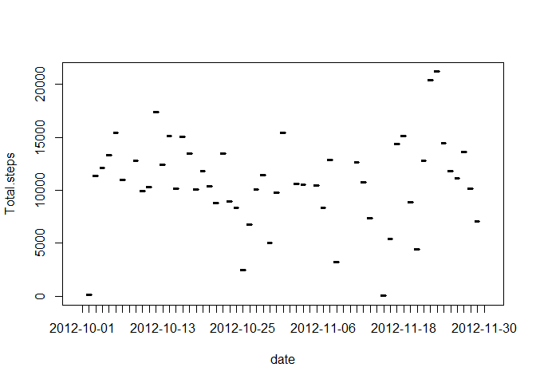
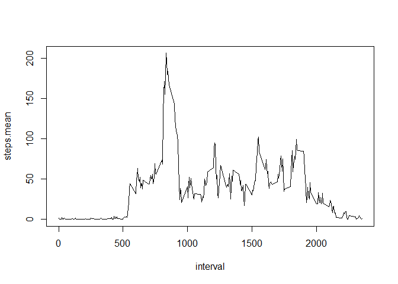
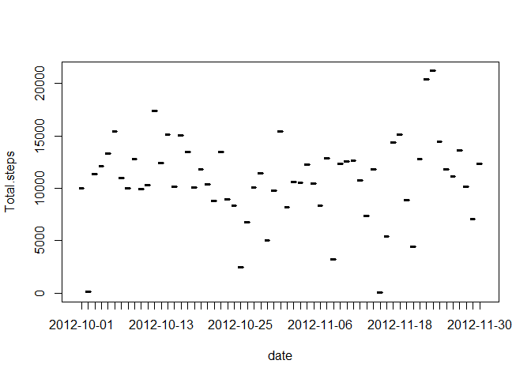
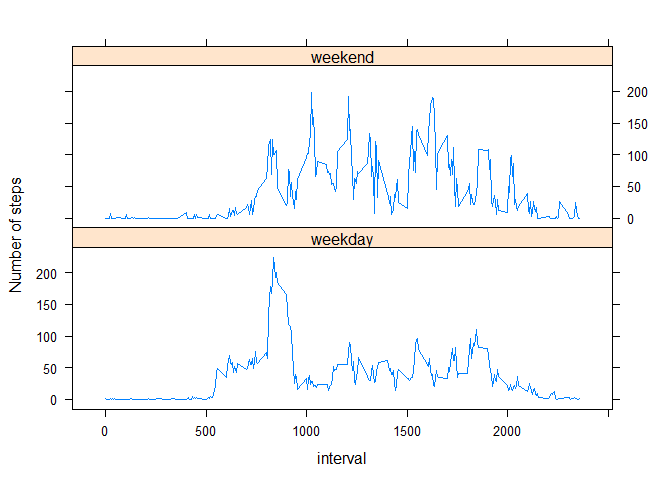

# Reproducible Research: Peer Assessment 1
Aritz  
15 de noviembre de 2015  


## Loading and preprocessing the data
### Load the data
In order to mantain the file foquitrmat as it is I unzip the file and read the .csv inside the zip


```r
data<-read.csv(unzip("activity.zip"))
head(data)
```

```
##   steps       date interval
## 1    NA 2012-10-01        0
## 2    NA 2012-10-01        5
## 3    NA 2012-10-01       10
## 4    NA 2012-10-01       15
## 5    NA 2012-10-01       20
## 6    NA 2012-10-01       25
```
### Process/transform the data
After this operation I generate a vector to find the na values and a new list without those na values.


```r
na_vector<-is.na(data$steps)
data_no_na <- data[!na_vector,]
head(data_no_na)
```

```
##     steps       date interval
## 289     0 2012-10-02        0
## 290     0 2012-10-02        5
## 291     0 2012-10-02       10
## 292     0 2012-10-02       15
## 293     0 2012-10-02       20
## 294     0 2012-10-02       25
```

## What is mean total number of steps taken per day?

### Histogram of the total number of steps taken each day 

First we calculate a new list with the addition of the number of steps per day. 


```r
total_per_day<- aggregate(list(`Total steps`= data_no_na$steps), by=list(date=data_no_na$date), FUN=sum)
plot(total_per_day, type="h")
```

 

### Calculate the mean and median total number of steps taken per day


```r
total_per_day_mean <- mean(total_per_day$`Total.steps`)
total_per_day_median <- median(total_per_day$`Total.steps`)
```


With the list calculated previously I calculate the mean and the median:

* The mean is 10766.19
* The median is 10765


## What is the average daily activity pattern?

Here we have a plot showing the average number of steps in each 5 minutes interval, averaged across all days.


```r
mean_per_interval <- aggregate(list(`steps mean`=data_no_na$steps), by=list(interval=data_no_na$interval), FUN=mean)
plot(mean_per_interval, type="l")
```

 


```r
max_interval <- mean_per_interval[which.max(mean_per_interval$`steps.mean`),]
max_interval
```

```
##     interval steps.mean
## 104      835   206.1698
```

The 5 minutes interval with the maximum averaged number of steps (across all days) is 8:35

## Imputing missing values


```r
num_na <- sum(na_vector)
num_na
```

```
## [1] 2304
```

There are 2304 NA values (steps column) in the dataset

To fill the NA values I am going to use the rounded media value for the same day and interval time 


```r
media_per_interval_day<-aggregate(x=list(media=data_no_na$steps), by=list(day=weekdays(as.Date(data_no_na$date)), interval=data_no_na$interval), FUN=mean)
media_per_interval_day$media<- round(media_per_interval_day$media)
data_media_na <-data
data_length <-length(data_media_na$steps)

for(i in 1:data_length)
{
  if (is.na(data_media_na[i,"steps"]))
    data_media_na[i,"steps"]<-floor(media_per_interval_day[(media_per_interval_day$day==weekdays(as.Date(data_media_na[i,"date"])) & media_per_interval_day$interval==data_media_na[i,"interval"]),]$media)
}
total_per_day_media_na<- aggregate(list(`Total steps`= data_media_na$steps), by=list(date=data_media_na$date), FUN=sum)
plot(total_per_day_media_na, type="h")
```

 

The only diference between this plot and the first one is the number of samples we are showing. Now we have more as we have add those days with NA values in the original dataset.


```r
total_per_day_mean_media_na <- mean(total_per_day_media_na$`Total.steps`)
total_per_day_median_media_na <- median(total_per_day_media_na$`Total.steps`)
```

The new values for the mean and the media are:

* The mean is 10821.1
* The median is 1.1015\times 10^{4}

Those new values are close to the previous one but are slightly different. Those differences depend on the strategy to fill the NA values. My strategy generates higher values because the NA values are mainly placed in the weekdays with a total number of steps per day over the media.  

## Are there differences in activity patterns between weekdays and weekends?


```r
temp_index<-weekdays(as.Date(data_media_na$date))=="domingo" | weekdays(as.Date(data_media_na$date))=="sabado" 
data_media_na$day[temp_index]<-rep("weekend", sum(temp_index))
data_media_na$day[!temp_index]<-rep("weekday", sum(!temp_index))
head(data_media_na)
```

```
##   steps       date interval     day
## 1     1 2012-10-01        0 weekday
## 2     0 2012-10-01        5 weekday
## 3     0 2012-10-01       10 weekday
## 4     0 2012-10-01       15 weekday
## 5     0 2012-10-01       20 weekday
## 6     5 2012-10-01       25 weekday
```


```r
weektype_avg <- aggregate(x=list(media=data_media_na$steps), by=list(day=data_media_na$day, interval=data_media_na$interval), FUN=mean)

library(lattice)
xyplot(weektype_avg$media~weektype_avg$interval | weektype_avg$day, ylab=" Number of steps", xlab="interval", type="l", layout=c(1,2))
```

 


